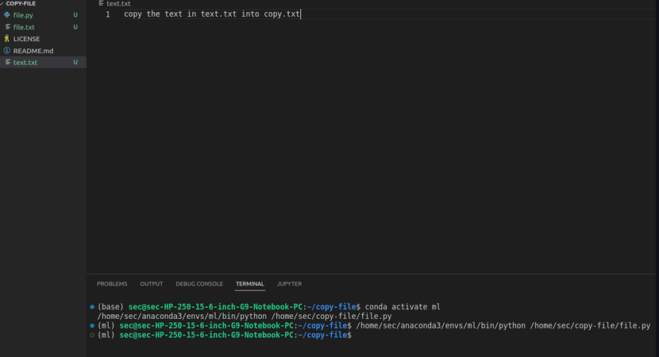

# copy-file
## AIM:
To write a python program for copying the contents from one file to another file.

## EQUIPEMENT'S REQUIRED: 
PC
Anaconda - Python 3.7
## ALGORITHM: 
Step 1:
First we need to open the required file from one file to another file.

Step 2:
Using key word "with" to open the required file

Step 3:
Use for loop to get content from firstfile

Step 4:
use write function to write on secondfile

Step 5:
exit the program

## PROGRAM:
```
import pandas as pd
f=pd.read_csv("nba.csv")
print(f.head(10))
print(f.tail())
print("Row",len(f.axes[0]))
print("Col",len(f.axes[1]))
```
### OUTPUT:



## RESULT:
Thus the program is written to copy the contents from one file to another file.
